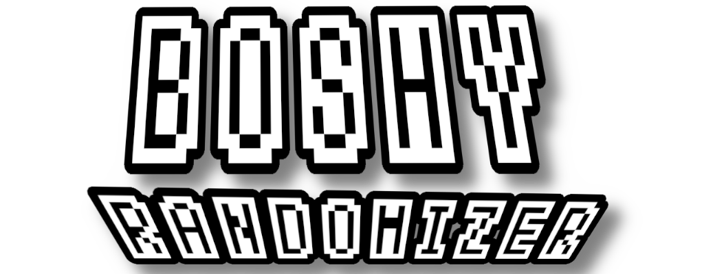

  

  
<strong>Created by THXel &amp; the I Wanna Be The Boshy Speedrun Community</strong> 
  © 2025 THXel

---

## 🟦 **About**  
> 🎮 *Fan-made Randomizer for "I Wanna Be The Boshy"*  
> Modern • Clean • Fully Automated

The **Boshy Randomizer** enhances the original game with:

✔️ Random levels, bosses, characters & collectables  
✔️ Automatic triggers & segment detection  
✔️ Live Overlay / Run Tracker  
✔️ Statistics, achievements & progress logs  
✔️ Fully automated setup and verification  

Built by **THXel** with support from the **Boshy Speedrun Community**.

> ⚠️ This is **not the original game** — only the Randomizer tool.  
> You must provide the game manually (see Installation).

---

## 🟩 **Requirements**
- Windows 10 or newer  
- Internet connection (first launch setup)

---

## 🟧 **Installation & Startup**

### **1️⃣ Download the Original Game**
https://grynsoft.com/old-games

---

### **2️⃣ Install the Randomizer**
After installation, **Boshy Randomizer.exe** appears automatically.

---

### **3️⃣ Launch**
The launcher confirms:

✔ Game installed  
✔ Python + modules available  
✔ All files exist  

---

### **4️⃣ If the Game is Missing**
You will be prompted to select the ZIP.  
It gets extracted automatically into `/IWBTB`.

---

## 🟪 **Game Information**

### ⭐ Starting a Run
- Always begins in the **Tutorial**  
- Then either:
  - **Random Route Mode**, or  
  - **Target Collect Mode** (if enabled)

---

### ⭐ Characters
- Default: **Dark Boshy**  
- Optional: **Random Character**  
  - Random at start  
  - Or per-level/boss (toggle in GUI)

---

### ⭐ First-Time Notes
- **Ctrl + R** → start new run  
- Only **SaveFile1** is used  
- SaveFile2 & 3 are disabled  
- Closing the game ends the current run  

---

### ⭐ System Behavior
- Achievements persist the entire run  
- Triggers balanced for maximum stability  
- Some complex rooms split into 2 zones  

---

### ⭐ Collectables
- **Awesomesauce active by default**  
- Ensures all items + Gastly can spawn  

---

### ⭐ If a Trigger Fails
Just keep playing — it will auto-recover.  
Persistent issues → report to Discord.

---

### ⭐ Live Tracker Shows:
- Achievements  
- Collectables  
- Bosses  
- Characters  
- Target items (Target Mode)  
Plus: real-time pop-up notifications.

---

## 🟥 **Target Collect Mode**
- Standard routes hidden  
- Required targets must be collected  
- All optional levels unlocked  
- Gastly & Cheetahman forced  
- Final boss (Solgryn) spawns automatically when targets are complete

---

## 🟫 **Known Notes**
- Some triggers intentionally offset for stability  
- Avoid mods/savefiles that overwrite Randomizer files  

---

## 🔧 **Technical Details**
- Python **3.11**
- Libraries:
  - `pygetwindow`
  - `pyautogui`
  - `pillow`
  - `numpy`
  - `tkinter`
- Logs:
  - `INI/randomizer_debug.log`

---

## 🟨 **Support & Community**
**Twitch:**  
https://twitch.tv/THXel  

**Discord:**  
https://discord.gg/ZXgTFjGw  
*(I Wanna Be The Boshy Speedrun Discord)*

---

## ⚫ **Disclaimer**
This project is unofficial and not affiliated with Solgryn  
or any official *I Wanna Be The Boshy* releases.

Use at your own risk.  
**Have fun — and don’t get boshy’d!** 😈

